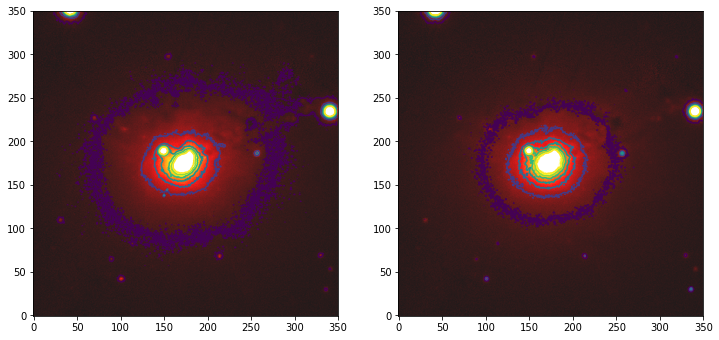
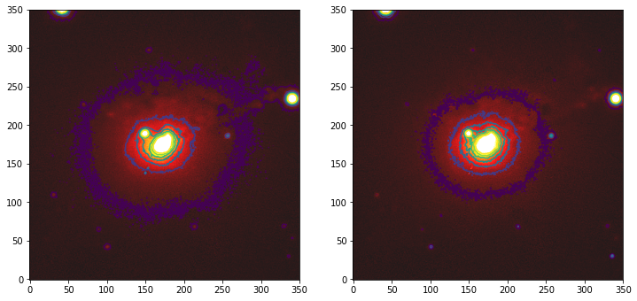

## imgvis

Visualization Demo on LSST DSFP S5D4

- explore multi-wavelength visualization, as well as hidden structure
- adjust dynamical range based on various statistical assumption

### Contour plot

### different band comparison

